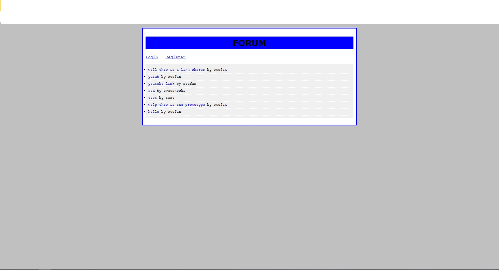

# stockforum
well this is a forum if it was coded in 90s 

bare bones project, working on backends and stuff 

SQL:

SET SQL_MODE = "NO_AUTO_VALUE_ON_ZERO";
SET AUTOCOMMIT = 0;
START TRANSACTION;
SET time_zone = "+00:00";

/*!40101 SET @OLD_CHARACTER_SET_CLIENT=@@CHARACTER_SET_CLIENT */;
/*!40101 SET @OLD_CHARACTER_SET_RESULTS=@@CHARACTER_SET_RESULTS */;
/*!40101 SET @OLD_COLLATION_CONNECTION=@@COLLATION_CONNECTION */;
/*!40101 SET NAMES utf8mb4 */;

--
-- Database: `if0_37308779_base`
--

-- --------------------------------------------------------

--
-- Table structure for table `posts`
--

CREATE TABLE `posts` (
  `id` int(11) NOT NULL,
  `thread_id` int(11) NOT NULL,
  `user_id` int(11) NOT NULL,
  `content` text NOT NULL,
  `created_at` timestamp NOT NULL DEFAULT current_timestamp()
) ENGINE=MyISAM DEFAULT CHARSET=latin1 COLLATE=latin1_swedish_ci;

-- --------------------------------------------------------

--
-- Table structure for table `threads`
--

CREATE TABLE `threads` (
  `id` int(11) NOT NULL,
  `user_id` int(11) NOT NULL,
  `title` varchar(255) NOT NULL,
  `created_at` timestamp NOT NULL DEFAULT current_timestamp(),
  `content` text NOT NULL
) ENGINE=MyISAM DEFAULT CHARSET=latin1 COLLATE=latin1_swedish_ci;

-- --------------------------------------------------------

--
-- Table structure for table `users`
--

CREATE TABLE `users` (
  `id` int(11) NOT NULL,
  `username` varchar(50) NOT NULL,
  `password` varchar(255) NOT NULL,
  `email` varchar(100) NOT NULL,
  `created_at` timestamp NOT NULL DEFAULT current_timestamp()
) ENGINE=MyISAM DEFAULT CHARSET=latin1 COLLATE=latin1_swedish_ci;

--
-- Indexes for table `posts`
--
ALTER TABLE `posts`
  ADD PRIMARY KEY (`id`),
  ADD KEY `thread_id` (`thread_id`),
  ADD KEY `user_id` (`user_id`);

--
-- Indexes for table `threads`
--
ALTER TABLE `threads`
  ADD PRIMARY KEY (`id`),
  ADD KEY `user_id` (`user_id`);

--
-- Indexes for table `users`
--
ALTER TABLE `users`
  ADD PRIMARY KEY (`id`),
  ADD UNIQUE KEY `username` (`username`);

--
-- AUTO_INCREMENT for dumped tables
--

--
-- AUTO_INCREMENT for table `posts`
--
ALTER TABLE `posts`
  MODIFY `id` int(11) NOT NULL AUTO_INCREMENT, AUTO_INCREMENT=10;

--
-- AUTO_INCREMENT for table `threads`
--
ALTER TABLE `threads`
  MODIFY `id` int(11) NOT NULL AUTO_INCREMENT, AUTO_INCREMENT=12;

--
-- AUTO_INCREMENT for table `users`
--
ALTER TABLE `users`
  MODIFY `id` int(11) NOT NULL AUTO_INCREMENT, AUTO_INCREMENT=6;
COMMIT;

/*!40101 SET CHARACTER_SET_CLIENT=@OLD_CHARACTER_SET_CLIENT */;
/*!40101 SET CHARACTER_SET_RESULTS=@OLD_CHARACTER_SET_RESULTS */;
/*!40101 SET COLLATION_CONNECTION=@OLD_COLLATION_CONNECTION */;

